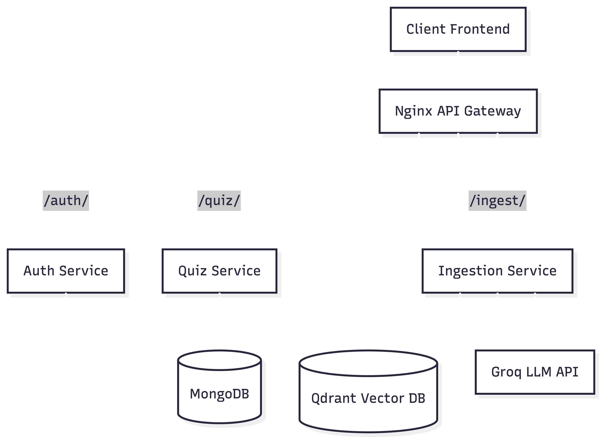

# Peblo - AI Quiz Platform

Peblo is a modern, AI-powered quiz platform built with a microservices architecture. It enables teachers to upload educational PDFs, instantly generates quizzes using LLMs, and allows students to take adaptive quizzes tailored to their performance.

## System Architecture

Peblo routes external requests through an Nginx API Gateway to three distinct, specialized microservices. All services connect to a shared MongoDB instance, and the ingestion service interacts with external LLMs and Vector databases.



## Setup & Local Development

### 1. Configure Environment Variables

Create a `.env` file in the root directory (you can copy `.env.example` if it exists). The environment variables must be populated to connect to the databases and external APIs.

```env
# MongoDB Connection (Shared Datastore)
MONGODB_URI=mongodb+srv://<your_username>:<your_password>@<your_cluster>.mongodb.net/
DATABASE_NAME=peblo

# Qdrant Vector DB (For Ingestion & Deduplication)
QDRANT_URL=https://<your_cluster>.aws.cloud.qdrant.io:6333
QDRANT_API_KEY=<your_qdrant_api_key>

# LLM APIs (Comma separated for key rotation to avoid rate limits)
GROQ_API_KEYS=key1,key2,key3

# JWT Security (Used to issue and verify access tokens)
SECRET_KEY=your-super-secret-jwt-key
ALGORITHM=HS256
ACCESS_TOKEN_EXPIRE_MINUTES=1440
```

### 2. Install Dependencies (For Local Testing)

If you wish to run the automated tests or develop logic directly on your host machine without Docker, install the python dependencies using a virtual environment:

```bash
# Create and activate virtual environment
python3 -m venv venv
source venv/bin/activate

# Install microservice dependencies
pip install -r services/auth/requirements.txt
pip install -r services/ingestion/requirements.txt
pip install -r services/quiz/requirements.txt

# Install testing utilities
pip install pytest httpx pytest-asyncio
```

### 3. Run the Backend (Docker)

The production-ready way to run the entire backend stack (including all three microservices and the Nginx gateway) is using Docker Compose:

```bash
docker-compose up --build
```

The API Gateway will be available at `http://localhost`. All requests should be sent to this base URL, and Nginx will route them to the appropriate underlying microservice.

### 4. How to Test Endpoints

We provide comprehensive, automated unit tests for every microservice using `pytest` and FastAPI's `TestClient` to test the endpoints and internal logic.

To run the complete set of tests across all microservices, run the provided bash script:

```bash
# Ensure your virtual environment is activated
source venv/bin/activate

# Execute the test suite script
./test.sh
```

Alternatively, to run tests for an individual microservice, you can navigate into its directory and run pytest manually (ensure your `PYTHONPATH` allows resolution of the `app` module):

```bash
# Example: Testing the Ingestion Service individually
cd services/ingestion
PYTHONPATH=. pytest -v
```

---

## Architectural Acknowledgements & Limitations

While Peblo implements a robust microservices pattern, a few intentional design trade-offs were made for the scope of this assessment:

1. **Auth Service Code Duplication:** The JWT validation logic/utilities and user models are duplicated across the Auth, Ingestion, and Quiz services. In a full production environment, this would either be abstracted into a shared internal Python library, or the API Gateway would be configured to validate tokens before routing traffic downstream.
2. **In-Memory TTL Caching:** The Quiz service utilizes a simple in-memory `TTLCache` to speed up question retrieval without constantly querying MongoDB. Because it is in-memory, the cache is wiped whenever the individual container restarts or scales horizontally. A distributed cache like Redis would be preferred in production.
